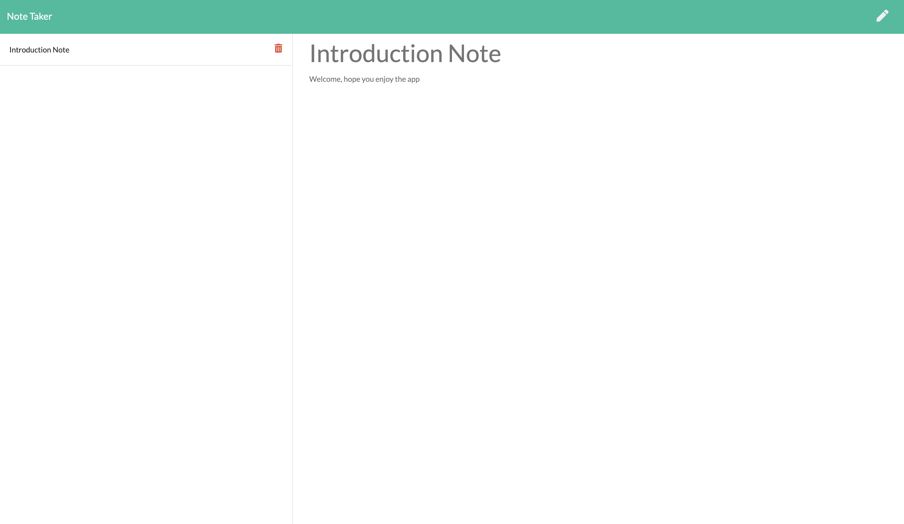

# Note Taker

## Description

The purpose of this app is to write, save, and delete notes. This application uses an express backend to save and retrieve note data from a JSON file.

- The following HTML routes are included in this app:

  - GET `/notes` - which returns the `notes.html` file.

  - GET `*` - which returns the `index.html` file

- The application has`db.json` file on the backend that is used to store and retrieve notes using the `fs` module.

- The following API routes are included in this app:

  - GET `/api/notes` - which reads the `db.json` file and return all saved notes as JSON.

  - POST `/api/notes` - which receive a new note to save on the request body, add it to the `db.json` file, and then return the new note to the client.

  - DELETE `/api/notes/:id` - which receive a query parameter containing the `id` of a note to delete.

## Demo

### In order to understand how the app works, please view the video below

